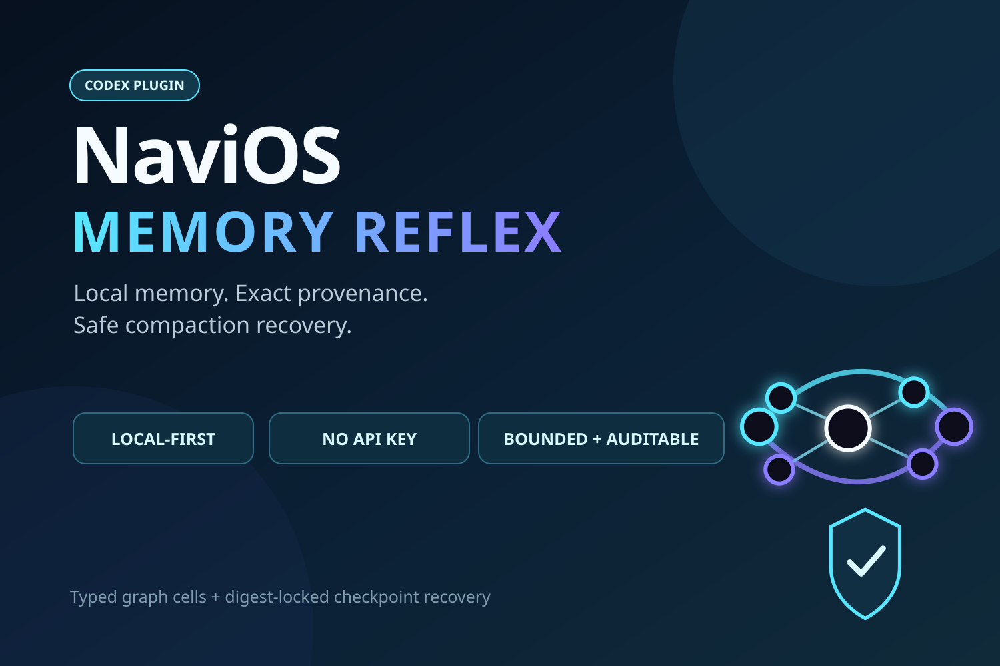

# NaviOS Memory Reflex

[](https://github.com/Simon-Omega-Magus/NaviOS-Memory-Core/actions/workflows/ci.yml)

NaviOS Memory Reflex is a local-first memory and compaction-recovery layer for Codex. It turns selected project notes into provenance-addressed cells, retrieves relevant evidence on each prompt, expands through typed graph edges, and restores a frozen authoritative checkpoint after context compaction.

This Build Week release deliberately makes a narrower claim than "infinite memory": it provides a runnable, inspectable memory reflex with explicit abstention and exact evidence handles.



## What It Demonstrates

- **Prompt memory reflex:** Codex `UserPromptSubmit` hooks retrieve relevant project memory automatically.
- **Exact provenance:** Every result carries a relative path, line range, cell ID, and SHA-256 content handle.
- **Typed graph expansion:** Lexical seeds expand through sequence, heading, explicit-link, backlink, and shared-tag edges.
- **Query triangulation:** Distinct query formulations reward evidence found from multiple directions.
- **Safe abstention:** Unrelated queries inject nothing instead of forcing a nearest neighbor.
- **Compaction recovery:** A digest-locked checkpoint is frozen before compaction and delivered afterward.
- **Fail-safe tool boundary:** If normal recovery delivery is late, the first tool call is cancelled and receives the frozen bundle.
- **Local processing:** The default index and retrieval engine use Python and SQLite without a remote embedding API.

## Three-Minute Judge Demo

Requirements: Python 3.10 or newer on Linux or macOS and a writable temporary directory (normally `/tmp`). No API key or package installation is needed.

```bash
git clone --branch build-week-2026-memory-reflex \
  https://github.com/Simon-Omega-Magus/NaviOS-Memory-Core.git
cd NaviOS-Memory-Core
python3 demo/run_demo.py
```

The demo copies a small project into a temporary directory, builds its index, runs three triangulation queries, simulates the Codex compaction hook sequence, and shows the intentionally cancelled first tool call plus recovered checkpoint. It never reads the judge's own files.

Run all focused tests:

```bash
python3 -m unittest -v tests/test_memory_reflex.py
```

## Standalone CLI

The bundled CLI can be run directly:

```bash
PLUGIN=plugins/navios-memory-reflex
python3 "$PLUGIN/scripts/navios-memory" --root ./my-project init
```

Edit `my-project/.navios/config.json` to select sources and fill in `my-project/.navios/checkpoint.md`. Then:

```bash
python3 "$PLUGIN/scripts/navios-memory" --root ./my-project index
python3 "$PLUGIN/scripts/navios-memory" --root ./my-project query \
  "current objective" "accepted constraints" "related architecture" \
  --top 8 --hops 2
```

An optional package install provides the `navios-memory` command:

```bash
python3 -m pip install .
```

## Codex Plugin

This repository is also a valid Codex marketplace. With a current Codex CLI:

```bash
codex plugin marketplace add Simon-Omega-Magus/NaviOS-Memory-Core \
  --ref build-week-2026-memory-reflex
codex plugin add navios-memory-reflex@personal
```

Start a new Codex thread inside a project initialized with `navios-memory init`. The hooks remain dormant in projects without a `.navios/` directory.

Supported plugin surface:

- Codex CLI 0.144.4 or newer
- Linux and macOS
- Python 3.10 or newer

The standalone CLI is independent of Codex and should work anywhere Python and SQLite are available; Codex hook support is currently tested on Linux.

## How Retrieval Works

```text
selected local files
        |
        v
provenance cells ---- typed edges
        |                  |
        +---- lexical seeds+
                 |
                 v
       bounded graph expansion
                 |
                 v
       triangulated context packet
                 |
                 v
       Codex prompt hook injection
```

Documents are split along headings and paragraphs into sentence or passage cells. The SQLite index is a replaceable projection; original files remain authoritative. BM25-style lexical scoring supplies evidence-bearing seeds. Graph traversal can then surface adjacent or explicitly linked context without turning unrelated hubs into unconditional results.

Multiple queries are scored independently and normalized before combination. Cells reached by more than one formulation receive a triangulation bonus. If no query has a lexical seed, retrieval abstains and graph expansion never starts.

## Compaction Recovery

1. `UserPromptSubmit` injects a bounded provenance packet and stores only its redacted packet plus the prompt SHA-256, not the raw prompt.
2. `PreCompact` freezes `.navios/checkpoint.md` and the last packet into a digest-locked bundle.
3. `PostCompact` marks recovery pending.
4. `SessionStart` or `UserPromptSubmit` injects the frozen bundle.
5. If those events arrive out of order, `PreToolUse` cancels one tool call, injects recovery, and requires the agent to review and reissue an appropriate operation.

Session recovery state is stored with private permissions under `~/.local/state/navios-memory-reflex/`, outside the project repository.

## Security Boundaries

- Suspicious filenames containing terms such as `token`, `secret`, `credential`, `.env`, or private-key names are excluded.
- `.naviosignore` and config exclusions should still be reviewed before indexing.
- Filename exclusion is a backstop, not a content-aware secret scanner.
- Raw transcripts are not copied into project memory.
- Retrieved cells are evidence, not execution authority.
- The system does not resolve contradictions automatically or replace deterministic policy, tests, permissions, and sandboxing.

## Build Week Extension

The repository contains April 2026 experiments with hardlink-backed brain matter and GraphSAGE. Those are preserved in [`legacy/gnn-v4`](legacy/gnn-v4) and are not required by the working demonstration.

The `build-week-2026-memory-reflex` branch adds the post-July-13 implementation evaluated here:

- dependency-light cell index and typed graph
- exact provenance packets and negative-control abstention
- multi-query triangulation
- Codex plugin, skill, and compaction hooks
- privacy-preserving hook state
- deterministic judge demo and focused tests

See [Build Week development record](docs/BUILD_WEEK_2026.md) for the distinction between prior work and the submitted extension.

## Judge Media

- [Project thumbnail](media/navios-memory-reflex-thumbnail.png)
- [Architecture visual](media/navios-memory-reflex-architecture.png)
- [Deterministic proof visual](media/navios-memory-reflex-proof.png)
- [Under-three-minute video script](docs/DEMO_VIDEO_SCRIPT.md)
- [YouTube title, description, timestamps, and upload settings](docs/YOUTUBE_UPLOAD.md)

The optional `media/render-demo-video.sh` script produces a complete narrated
fallback video when `ffmpeg`, `ffprobe`, and `espeak-ng` are installed.

## Codex and GPT-5.6 Collaboration

GPT-5.6 in Codex was used to audit the pre-existing repository, reduce an expansive research architecture to a testable product boundary, implement the new plugin and deterministic engine, construct adversarial tests, and reproduce a real hook-ordering failure where `PostCompact` can arrive after recovery delivery. The human retained product direction, privacy constraints, scope approval, contest registration, and final publication decisions.

The required `/feedback` Codex session ID is supplied in the Devpost submission.

## Honest Limitations

- This release is not an infinite context window.
- Retrieval quality still depends on source quality and explicit graph structure.
- It does not yet learn edge weights continuously.
- GraphSAGE remains experimental until it beats the deterministic baseline on held-out prospective tasks.
- Contradiction detection and authority/currentness classification remain separate research tracks.

## License

MIT. See [LICENSE](LICENSE).
